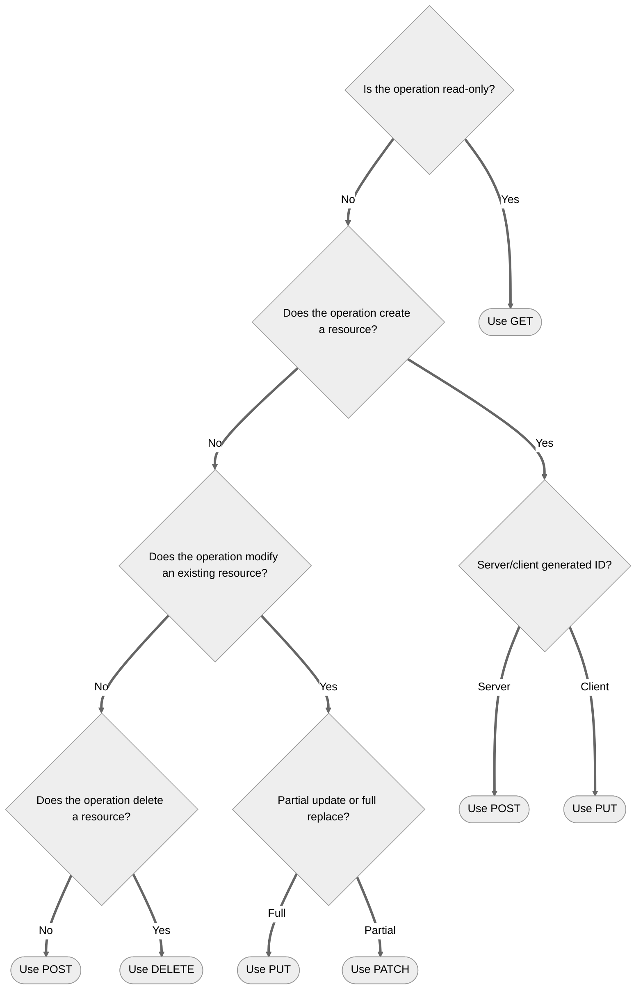

# HTTP Methods

This AEP establishes standards for how APIs use HTTP methods. Consistent and correct use of HTTP methods ensures
that APIs are predictable, maintainable, and align with REST principles and HTTP standards defined in [RFC 9110].

HTTP methods are standardized actions that indicate the desired operation to be performed on a resource. The method
represents the _action_ (verb) being performed on the _resource_ (noun) identified by the URI path. The request method
is the primary source of request semantics; it indicates the purpose for which the client has made the request and what
the client expects as a successful result.

This AEP provides general guidance applicable to all HTTP methods. Detailed requirements for individual methods are
covered in separate AEPs (see Method Details table below).

## Guidance

### Choosing the Right Method

APIs **must** use HTTP methods in accordance with their standardized semantics as defined in [RFC 9110]. This means:

* Methods **must** be used for their intended purpose
* Methods **must** respect their safety, idempotency, and cacheability properties
* Methods **must not** be repurposed for operations that conflict with their standard semantics

The following table summarizes the most common HTTP methods and their proper use:

| Method   | Description                                                 | Use Case                                                   | Example                                                               |
|----------|-------------------------------------------------------------|------------------------------------------------------------|-----------------------------------------------------------------------|
| [GET]    | Retrieves a representation of the specified resource        | Fetching information, reading resources                    | `GET /books` retrieves a list of books                                |
| [POST]   | Perform resource-specific processing on the request content | Creating resources, triggering actions, or processing data | `POST /books` creates a new book                                      |
| [PUT]    | _Fully_ replaces or creates the specified resource          | Replacing an existing resource, creating a new resource    | `PUT /books/123` updates all fields for (or creates) book with ID 123 |
| [PATCH]  | _Partially_ updates the specified resource                  | Modifying specific attributes of an existing resource      | `PATCH /books/123` updates only certain fields of book 123            |
| [DELETE] | Deletes the specified resource                              | Removing a resource                                        | `DELETE /books/123` deletes book with ID 123                          |

**Note:** When standard HTTP methods don't fit your use case, refer to the [custom methods] AEP for guidance on
designing custom operations within RESTful constraints.

### Method Not Allowed

Use [405 Method Not Allowed] when the server understands the HTTP method sent by a client, but the target resource does
not support that particular method. This indicates a deliberate design decision: the resource exists, and the method is
valid, but they are incompatible.

A `405` response means "I understand what you're asking me to do (e.g., delete), but you can't do that to this specific
resource by design"

When this happens:

* The server **must** respond with [405 Method Not Allowed]
* The response **may** include an [Allow header] listing supported methods
* The server **must not** respond with `404 Not Found` when the method is not allowed

### Not Implemented

Use [501 Not Implemented] when the server does not support the functionality required to fulfill the request. This
applies in two scenarios:

* The server does not recognize the HTTP method at all (e.g., a non-standard or custom method)
* The server recognizes a standard method but has not yet implemented support for it

A `501` response means "I'm sorry, this hasn't been implemented yet" or "I don't even understand what you're asking me
to do"

When this happens:

* The server **must** respond with [501 Not Implemented]
* The response **may** include information about when or if the functionality will be available (e.g.,
  the [Retry-After header])
* The server **must not** respond with `404 Not Found` when the method is unsupported or unrecognized

### Common Method Properties

Method implementations **must** fulfill the following properties, according to [RFC 9110 Section 9.2]:

| Method   | Safe | Idempotent | Cacheable |
|----------|------|------------|-----------|
| [GET]    | Yes  | Yes        | Yes       |
| [POST]   | No   | No*        | No        |
| [PUT]    | No   | Yes        | No        |
| [PATCH]  | No   | No*        | No        |
| [DELETE] | No   | Yes        | No        |

\* `POST` and `PATCH` are not inherently idempotent, though specific implementations may be designed to be idempotent.
See their respective AEPs for details.

**Safe Methods**: Methods whose semantics are essentially read-only. The client does not request, and does not expect,
any state change on the server as a result of applying a safe method to a target resource. Safe methods allow for
prefetching, caching, and other optimizations without concern for side effects.

**Idempotent Methods**: Methods where multiple identical requests have the same effect as a single request. Idempotency
is critical for reliable operations over unreliable networks—clients can safely retry idempotent requests without fear
of unintended side effects.

**Cacheable Methods**: Methods whose responses may be stored for future reuse. Cacheability enables performance
optimization and reduces server load. Generally, safe methods are cacheable, while methods that modify a resource state
are not.

### Less common HTTP Methods

These methods are used in HTTP and have crucial functions; however, they are less often implemented in the context
of REST APIs, so we will only briefly cover them.

| Method    | Description                                                   | Use Case                                                                 | Example                                                                                    |
|-----------|---------------------------------------------------------------|--------------------------------------------------------------------------|--------------------------------------------------------------------------------------------|
| [HEAD]    | Same as GET, but without the response body                    | Checking resource existence or retrieving headers                        | `HEAD /books/123` retrieves headers of book with ID 123                                    |
| [OPTIONS] | Retrieves the HTTP methods supported by a resource            | Checking allowed methods or CORS preflight requests                      | `OPTIONS /books` retrieves allowed methods for interacting with books resource             |
| [TRACE]   | Performs a message loopback test along the request path       | Debugging and diagnostic purposes—verifying what is received at each hop | `TRACE /books` returns the request as received by the server, useful for debugging proxies |
| [CONNECT] | Establishes a tunnel to a server identified by the target URI | Creating end-to-end tunnels, typically for TLS/HTTPS through proxies     | `CONNECT api.example.com:443` establishes a tunnel to enable secure HTTPS communication    |

## Rationale

When APIs consistently use HTTP methods according to standard semantics, developers can predict behavior without
consulting extensive documentation. An API that uses GET for retrieval and POST for creation matches developer
expectations and reduces cognitive load.

HTTP clients, proxies, API gateways, and monitoring tools are built with assumptions about method semantics. Using
methods correctly ensures compatibility with:

* Browser behavior
* Caching layers
* API gateways and load balancers (which may handle methods differently)
* Development tools and testing frameworks

Proper use of safe and cacheable methods enables significant performance improvements through caching at multiple
layers (browser, CDN, reverse proxy). Idempotent methods allow for safe retry logic, improving reliability.

Mixing semantics creates security vulnerabilities. For example, using GET for state changes makes operations vulnerable
to CSRF attacks and unintended execution through prefetching or link sharing.

Following standard method semantics makes it easier to evolve APIs over time, as clients and servers share a common
understanding of behavior and expectations.

[RFC 9110]: https://datatracker.ietf.org/doc/html/rfc9110

[RFC 9110 Section 9.2]: https://datatracker.ietf.org/doc/html/rfc9110#section-9.2

[GET]: /get

[POST]: /post

[PUT]: /put

[PATCH]: /patch

[DELETE]: /delete

[HEAD]: https://developer.mozilla.org/en-US/docs/Web/HTTP/Reference/Methods/HEAD

[OPTIONS]: https://developer.mozilla.org/en-US/docs/Web/HTTP/Reference/Methods/OPTIONS

[TRACE]: https://developer.mozilla.org/en-US/docs/Web/HTTP/Reference/Methods/TRACE

[CONNECT]: https://developer.mozilla.org/en-US/docs/Web/HTTP/Reference/Methods/CONNECT

[405 Method Not Allowed]: https://developer.mozilla.org/en-US/docs/Web/HTTP/Reference/Status/405

[Allow header]: https://developer.mozilla.org/en-US/docs/Web/HTTP/Reference/Headers/Allow

[501 Not Implemented]: https://developer.mozilla.org/en-US/docs/Web/HTTP/Reference/Status/501

[Retry-After header]: https://developer.mozilla.org/en-US/docs/Web/HTTP/Reference/Headers/Retry-After

[custom methods]: /custom-methods

## Changelog

* **2025-12-02**: Updated method tables to include all HTTP methods and separated them into 2 sections.
* **2025-11-11**: Initial AEP-130 for Thryv, adapted from [Google AIP-130][] and aep.dev [AEP-130][].

[Google AIP-130]: https://google.aip.dev/130

[AEP-130]: https://aep.dev/130
