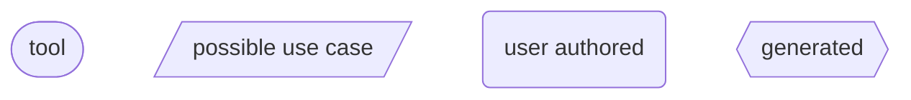
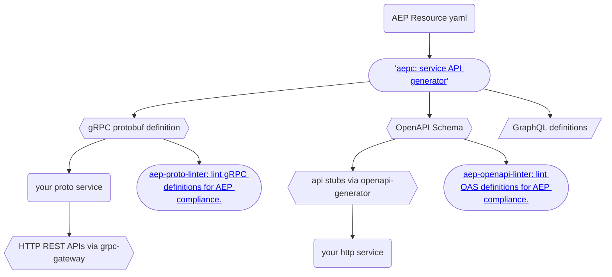
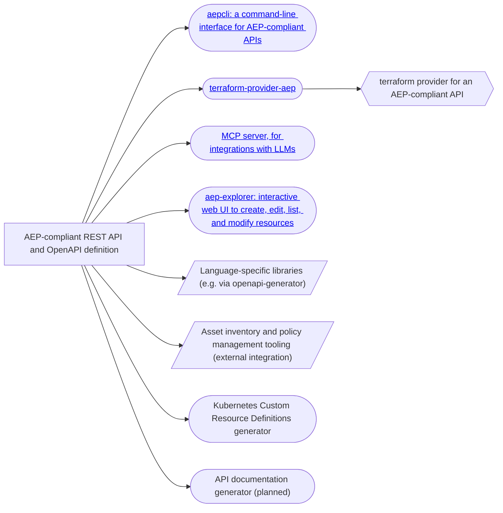

# Tooling and Ecosystem

In addition to an API design specification, AEPs also provide an ecosystem of
tooling to help produce and interact with these APIs.

## Tools

Get started quickly with these essential tools:

**Developer Tools**

- **[terraform-provider-aep](https://github.com/aep-dev/terraform-provider-aep)** -
  Terraform provider for AEP-compliant APIs
- **[aepcli](https://github.com/aep-dev/aepcli)** - Command-line interface for
  AEP-compliant APIs
- **[aep-explorer](https://github.com/aep-dev/aep-explorer)** - Interactive web
  UI for AEP-compliant APIs
- **[aepc](https://github.com/aep-dev/aepc)** - Generates AEP-compliant RPCs
  from proto messages

**Linting & Validation**

- **[aep-proto-linter](https://github.com/aep-dev/api-linter)** - Lint gRPC
  definitions for AEP compliance
- **[aep-openapi-linter](https://github.com/aep-dev/aep-openapi-linter)** -
  Lint OpenAPI definitions for AEP compliance

**AI**

- **[aep-mcp-server](https://github.com/aep-dev/aep-mcp-server)** - MCP server
  for AEP-compliant APIs
- **[aep.dev/llms.txt](https://aep.dev/llms.txt)** - llms.txt for AEP, to
  provide LLMs with knowledge of AEP guidelines.

**Community Tools**

We welcome contributions from the community! This section showcases tools built
by the AEP community that extend or complement the official tooling ecosystem.

- **[aep-typespec](https://github.com/thegagne/aep-typespec)** - Reference
  implementation using TypeSpec to generate AEP-compliant OpenAPI Schema.

## Diagram

The following is a diagram that illustrates an end-to-end workflow, including
nodes of tooling that exists, or is intended to be created for the project.

Some of the tools in the diagram are not maintained by the AEP project. The
diagram is intended to be a complete representation of tools available to help
a user understand how the tools fit into a development workflow.

The service generation tooling looks like:

While the client tooling for an AEP-compliant compatible API includes:

